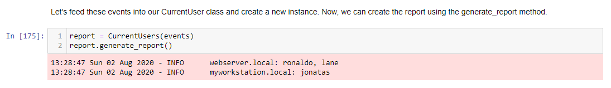

# Current Users Report

Generates a logfile report using logging library with all machine names, and the users connected to each machine.
Also, shows the report content on the prompt for debug purposes. 

This script is project-based suggested by Google following the "Crash Course on Python" on Coursera.
